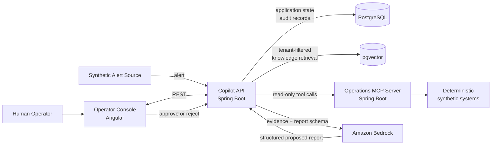

# Payment Incident Investigation Copilot

An auditable, human-in-the-loop platform for investigating synthetic payment
incidents.

The project demonstrates how an enterprise operations team could gather
fragmented system evidence, retrieve approved runbooks and policies, generate
a structured AI-assisted investigation report, and require an operator to
approve or reject the result before any action is taken.

> **Project status:** Foundation and first vertical slice in progress. The
> monorepo, service boundaries, local pgvector environment, baseline incident
> schema, development rules, and CI scaffold are established. Product features
> listed below are being implemented incrementally and are not presented as a
> finished production system.

## Why this project

Payment incidents rarely explain themselves. An operator may need to correlate
an alert with transaction attempts, gateway responses, service errors,
deployment history, runbooks, and internal policy before recommending a next
step.

This project explores how applied AI can reduce that investigative burden
without hiding uncertainty or removing human accountability. It is designed to
demonstrate full-stack engineering, enterprise integration, and responsible-AI
controls in one focused financial-services scenario.

## Target workflow

```text
Synthetic alert
    ↓
Operator alert queue
    ↓
Operator starts investigation
    ↓
Read-only MCP tools gather operational context
    ↓
pgvector retrieves relevant runbooks and policies
    ↓
Evidence is normalized with source metadata
    ↓
Amazon Bedrock generates a schema-constrained report
    ↓
Operator reviews evidence, inference, and recommendation
    ↓
Operator approves or rejects with a recorded reason
    ↓
Evidence, model metadata, report, and decision remain auditable
```

## Architecture



The applications share one Git repository for development convenience but
remain separate build and deployment units.

| Component | Responsibility |
|---|---|
| `operator-console` | Alert triage, investigation review, evidence presentation, and human decision |
| `copilot-api` | Workflow orchestration, persistence, retrieval, report generation, and auditing |
| `operations-mcp-server` | Repeatable synthetic source-system data exposed through read-only MCP tools |
| PostgreSQL/pgvector | Transactional state, audit records, runbooks, policies, and vector retrieval |
| Amazon Bedrock | Embeddings and structured report generation |

For the detailed sequence and ownership boundaries, see
[Architecture](docs/agent/ARCHITECTURE.md).

## Responsible-AI design

Responsible-AI behavior is part of the application contract, not an optional
prompt instruction.

- Model output is advisory and cannot approve itself or execute remediation.
- Observed evidence is separated from AI-generated inference.
- Report conclusions must reference supporting evidence identifiers.
- Missing, unavailable, and contradictory evidence remain visible.
- Generated reports must conform to an application-owned schema.
- Model, prompt, evidence, retrieval, and decision metadata are retained.
- Approval and rejection are explicit, attributable operator actions.
- The demonstration uses synthetic data only.

See [Constraints and guardrails](docs/agent/CONSTRAINTS.md) for the complete
boundary.

## Technology stack

| Area | Technologies |
|---|---|
| Backend | Java 21, Spring Boot 4, Spring MVC, Spring Data JPA |
| Applied AI | Spring AI, Amazon Bedrock, RAG, structured output |
| Integration | Model Context Protocol, REST APIs |
| Data | PostgreSQL, pgvector, Flyway |
| Frontend | Angular, TypeScript, SCSS |
| Delivery | Maven, Docker, Docker Compose, GitHub Actions, AWS |
| Testing | Spring Boot Test, JUnit, Testcontainers, Angular testing tools |

Dependency versions are controlled by the Maven and npm configuration rather
than duplicated throughout the documentation.

## Repository structure

```text
payment-incident-copilot/
├── frontend/
│   └── operator-console/          Angular operator interface
├── backend/
│   ├── copilot-api/               Main workflow and AI application
│   └── operations-mcp-server/     Synthetic operational tools
├── infra/
│   ├── local/                     Local-development infrastructure
│   └── aws/                       AWS infrastructure when selected
├── docs/
│   ├── agent/                     Product, architecture, task, and decision context
│   └── diagrams/                  Version-controlled visual documentation
├── .github/workflows/             Continuous integration
├── docker-compose.yml             Local PostgreSQL/pgvector
├── AGENTS.md                      Repository-wide development instructions
└── pom.xml                        Maven parent and module aggregator
```

## Current implementation status

- [x] Monorepo and independently deployable application boundaries
- [x] Maven parent and Spring Boot service skeletons
- [x] Local PostgreSQL/pgvector Compose configuration
- [x] Flyway baseline for tenant-scoped incidents
- [x] CI and repository-specific coding-agent instructions
- [ ] Synthetic alert intake and idempotency
- [ ] Angular alert queue
- [ ] Investigation lifecycle
- [ ] Read-only operational MCP tools
- [ ] Runbook and policy ingestion
- [ ] Tenant-filtered pgvector retrieval
- [ ] Bedrock structured investigation report
- [ ] Human approval and rejection workflow
- [ ] End-to-end audit timeline
- [ ] AWS deployment and live demonstration

The active implementation brief is maintained in
[Current task](docs/agent/tasks/current.md).

## Local development

### Prerequisites

- Java 21
- Maven 3.9+
- Docker with Docker Compose
- Node.js and Angular CLI when frontend implementation begins
- AWS account with Amazon Bedrock model access for the AI milestone

### 1. Configure the local environment

```bash
cp .env.example .env
```

The example contains local-only defaults. Do not place AWS keys or production
credentials in `.env` or source control. Deployed applications should use IAM
roles and managed secrets.

### 2. Start PostgreSQL with pgvector

```bash
docker compose up -d postgres
docker compose ps
```

### 3. Build the backend

```bash
mvn clean verify
```

### 4. Run the services

Run each service in its own terminal:

```bash
mvn -pl backend/copilot-api -am spring-boot:run
```

```bash
mvn -pl backend/operations-mcp-server -am spring-boot:run
```

The default local ports are:

- Copilot API: `8080`
- Operations MCP server: `8081`
- PostgreSQL: `5432`

### Frontend

The Angular workspace is intentionally not generated in the foundation commit.
It will be initialized as part of the first vertical-slice task so its version
and generated configuration are committed together. See
[Operator console setup](frontend/operator-console/README.md).

## Development workflow

Repository context is designed to work for both developers and AI coding
agents:

1. Read [AGENTS.md](AGENTS.md).
2. Review [Project definition](docs/agent/PROJECT.md) and
   [Constraints](docs/agent/CONSTRAINTS.md).
3. Check [Project status](docs/agent/STATUS.md).
4. Work against the acceptance criteria in
   [Current task](docs/agent/tasks/current.md).
5. Validate using [Quality and testing](docs/agent/QUALITY.md).
6. Record consequential architecture decisions under
   [`docs/agent/decisions`](docs/agent/decisions/).

Service-specific `AGENTS.md` files add focused rules for Angular, the copilot
API, and the MCP server.

## MVP boundaries

This project is a portfolio demonstration and learning environment. It does
not:

- Process, authorize, settle, or move money
- Use real customer, merchant, card, or bank-account data
- Provide production fraud scoring
- Perform autonomous remediation
- Represent a complete payment processor
- Claim production-grade multi-tenancy or regulatory compliance

## Roadmap

1. **Alert intake:** persist a validated synthetic alert and display it in the
   operator queue.
2. **Investigation:** introduce state transitions and gather deterministic
   evidence through MCP.
3. **Knowledge retrieval:** ingest approved Markdown runbooks and policies and
   retrieve tenant-filtered context with pgvector.
4. **AI report:** generate and validate an evidence-linked report through
   Amazon Bedrock.
5. **Human decision:** implement approval, rejection, reasons, and audit history.
6. **Deployment:** containerize the complete slice, deploy it to AWS, and publish
   a repeatable demonstration scenario.

## Author

**Christopher Guzowski**  
Full Stack Developer focused on Java, Spring Boot, Angular, AWS, and applied AI
integration.
