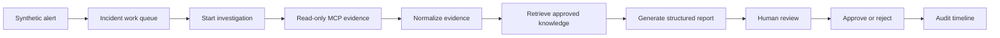

# Payment Incident Investigation Copilot

> **An auditable, human-in-the-loop AI copilot for payment-operations incident investigation.**

The Payment Incident Investigation Copilot helps a payment operations analyst move from a synthetic alert to a structured, reviewable investigation.

It brings together:

**synthetic alert → incident work queue → investigation → operational evidence → approved runbooks/policies → AI-assisted report → human decision → audit timeline**

The system is intentionally designed so that **observed evidence, retrieved knowledge, AI inference, and human decisions remain distinct and traceable**.

> **Project status:** The core end-to-end vertical slice is implemented and verified. The current SynTen Inc branch is focused on live approved-knowledge retrieval using Ollama `nomic-embed-text`. The fixed retrieval-quality benchmark remains a factual **FAIL** by design, while the engineering and operator-workflow acceptance criteria are satisfied.

---

## Why this project exists

Payment incidents rarely have a single source of truth.

An analyst may need to correlate:

- alerts and incident metadata
- service errors and operational telemetry
- gateway or upstream failures
- internal runbooks and policies
- retrieved source provenance
- the analyst's final decision

The goal of this project is not to replace the analyst. It is to **reduce the manual work of assembling an investigation while making the resulting reasoning auditable**.

The platform deliberately avoids autonomous remediation and does not process or move real money.

---

## What the operator sees

The main investigation workspace is built around independently loading panels for the major stages of an investigation:

- **Observed Evidence** — operational facts collected through read-only tools
- **Approved Knowledge** — relevant runbook/policy guidance with source provenance
- **Proposed Incident Report** — structured AI-generated analysis for human review
- **Audit Timeline** — chronological, reviewable history of the investigation and decision

The UI keeps evidence and inference visually separate so an analyst can distinguish what the system **observed** from what the model **concluded**.


> The screenshot above is a UI reference for the investigation workspace. The live SynTen Inc branch also records PDF provenance such as filename, SHA-256, page/block location, document/version/chunk IDs, approval actor, and effective time when approved knowledge is returned.

---

## Core workflow



The backend preserves the provenance of the major stages rather than collapsing them into one opaque AI call.

---

## Architecture

The repository is a monorepo containing independently deployable application boundaries.

```text
                           ┌──────────────────────┐
                           │  Synthetic Alert     │
                           │      Source          │
                           └──────────┬───────────┘
                                      │
                                      ▼
┌──────────────────────┐      ┌──────────────────────┐
│ Angular Operator     │◄────►│   Copilot API        │
│ Console              │      │ Spring Boot / Java 21│
└──────────────────────┘      └───────┬──────────────┘
                                      │
                 ┌────────────────────┼────────────────────┐
                 │                    │                    │
                 ▼                    ▼                    ▼
        ┌────────────────┐   ┌─────────────────┐   ┌─────────────────┐
        │ Operations MCP │   │ PostgreSQL +     │   │ Spring AI       │
        │ Server         │   │ pgvector         │   │ Provider        │
        │ read-only      │   │ state + retrieval│   │ Ollama locally  │
        └────────────────┘   └─────────────────┘   └─────────────────┘
```

### Service boundaries

| Component | Responsibility |
|---|---|
| `frontend/operator-console` | Incident queue, investigation workspace, review, and human decisions |
| `backend/copilot-api` | Workflow, persistence, retrieval, report generation, decisions, and audit history |
| `backend/operations-mcp-server` | Deterministic synthetic operational tools and fixtures |
| PostgreSQL | Transactional application state and audit records |
| pgvector | Tenant-filtered knowledge embeddings and vector retrieval |
| Ollama | Local embedding and model provider boundary used by the current development path |

The Copilot API is internally divided into explicit feature areas for incident lifecycle, evidence, knowledge catalog, knowledge retrieval, report generation, decisions, and audit projection. Architecture tests enforce the allowed package directions.

---

## AI / RAG design

This project uses retrieval as a **controlled evidence pipeline**, not as a black box.

Approved operational sources are:

1. versioned and validated
2. converted into page-aware chunks
3. embedded for semantic retrieval
4. filtered for tenant, approval, effective version, model compatibility, and superseded-source rules
5. ranked using hybrid lexical + vector retrieval
6. persisted with retrieval provenance

The current SynTen Inc corpus contains **30 PDF document versions**:

- 22 runbooks
- 8 policies
- 705 page-aware chunks

The active local embedding model is **Ollama `nomic-embed-text`** with normalized 768-dimensional vectors.

### Retrieval strategy

The current K5 retrieval path introduces:

- an evidence-focused `knowledge-query/v2`
- type-balanced lexical/vector candidate pools
- deterministic Reciprocal Rank Fusion (`postgres-hybrid-rrf/v2`)
- document-diverse context selection
- explicit eligibility and superseded-version filtering
- persisted query/ranking versions and retrieval provenance

This keeps retrieval behavior deterministic and inspectable instead of relying on an unconstrained similarity search.

---

## Human-in-the-loop by design

The application has explicit guardrails:

- **Synthetic data only**
- **No payment processing or money movement**
- **No autonomous remediation**
- **No autonomous report approval**
- **Observed evidence remains separate from AI inference**
- **Missing and contradictory evidence stays visible**
- **Human decisions are persisted as immutable-style records**
- **Evidence, retrieval, model, prompt, report, and decision provenance is retained**

These constraints are architectural requirements, not just UI messaging.

---

## SynTen Inc demonstration scenario

The project uses **SynTen Inc**, a fictional financial-services tenant, to keep the entire demonstration synthetic.

The primary incident family is a **payment authorization decline-rate spike**.

The live retrieval proof currently uses scenario `S001`, where the observed evidence includes:

- `GATEWAY_TIMEOUT`
- `UPSTREAM_CONNECTION_RESET`

For that scenario, the approved-knowledge workflow successfully returns the expected cited runbook as part of the operator-visible retrieval result.

---

## Current status

### Completed

- Synthetic alert ingestion and idempotent incident persistence
- Tenant-scoped incident work queue
- Investigation lifecycle and operator workspace
- Read-only MCP integration
- Append-only evidence collection/history
- Approved runbook/policy ingestion
- PostgreSQL + pgvector hybrid retrieval
- PDF-aware extraction and stable chunk provenance
- Structured report-generation path with strict schema validation
- Human approve/reject workflow
- Immutable-style audit timeline
- Docker/local development workflow
- Repository-wide verification and CI checks
- SynTen Inc synthetic corpus and retrieval evaluation framework
- Live `nomic-embed-text` embedding/index path
- Live operator proof showing cited approved knowledge

### K5 retrieval evaluation

The current fixed evaluation is intentionally preserved rather than "passed" by weakening its thresholds.

| Metric | Previous K4 | Current K5 |
|---|---:|---:|
| Primary runbook coverage | 9 / 22 | **19 / 22** |
| Supporting policy coverage | 1 / 20 | **12 / 20** |
| Primary-over-weak ranking | 16 / 21 | **16 / 21** |

The fixed thresholds require the third metric to reach 19/21, so the retained evaluation artifact remains a factual **FAIL**.

That distinction matters: the implementation passes its engineering/behavioral acceptance criteria while the benchmark continues to expose a measurable retrieval-quality gap.

### Current deliberate limitations

- Authentication is not implemented yet.
- Only `getRecentServiceErrors` is currently implemented as an operational evidence domain.
- Live chat-model selection is deferred from the current K5 milestone.
- AWS infrastructure and the production Bedrock profile are deferred.
- Knowledge ingestion is explicit rather than a continuous content-management pipeline.
- The project remains a single synthetic tenant and single incident family demonstration.

---

## Technology

| Area | Technology |
|---|---|
| Backend | Java 21, Spring Boot, Maven |
| AI orchestration | Spring AI |
| Local AI | Ollama |
| Retrieval | PostgreSQL + pgvector + hybrid lexical/vector search |
| Integration | Model Context Protocol (MCP) |
| Frontend | Angular, TypeScript, SCSS |
| Database migrations | Flyway |
| Infrastructure | Docker Compose |
| CI | GitHub Actions |
| Future deployment direction | AWS / optional Amazon Bedrock profile |

---

## Repository layout

```text
payment-incident-copilot/
├── backend/
│   ├── copilot-api/               # Main investigation application
│   └── operations-mcp-server/     # Synthetic read-only operational tools
├── frontend/
│   └── operator-console/          # Angular operator UI
├── SynTen Inc/
│   ├── corpus/                    # Synthetic runbooks and policies
│   └── evaluation/                # Retrieval cases and evaluation artifacts
├── contracts/
│   └── mcp/                       # Versioned MCP contract artifacts
├── docs/
│   └── agent/                     # Architecture, constraints, status, decisions
├── infra/                         # Deployment infrastructure
├── scripts/                       # Verification/evaluation tooling
├── syntheticIncidentGenerator/   # Synthetic incident generator
├── docker-compose.yml
├── verify.ps1
└── pom.xml
```

---

## Run locally

### Prerequisites

- Java 21
- Node.js 24.14.1
- npm 10.8.3
- PowerShell 7
- PostgreSQL with pgvector, or Docker Compose
- Ollama for live knowledge retrieval

Create local configuration from the safe template:

```powershell
Copy-Item .env.example .env
```

For live embedding retrieval:

```powershell
ollama pull nomic-embed-text
ollama serve
```

### Windows quick start

After configuring `.env` and the database:

```powershell
.\start-local.bat
```

The launcher checks prerequisites and starts:

- the operations MCP server
- the Copilot API
- the Angular operator console
- the synthetic incident generator

The normal local endpoints are:

```text
Operator Console   http://localhost:4200
Copilot API        http://localhost:8080
MCP Server         http://localhost:8081
Incident Generator http://localhost:8082
```

To run only the startup checks:

```powershell
.\start-local.bat --CheckOnly
```

### Manual development

Backend:

```powershell
.\mvnw.cmd clean verify
```

Operations MCP server:

```powershell
.\mvnw.cmd -pl backend/operations-mcp-server -am spring-boot:run
```

Copilot API:

```powershell
.\mvnw.cmd -pl backend/copilot-api -am spring-boot:run
```

Frontend:

```powershell
cd frontend/operator-console
npm ci
npm start
```

The Angular development server proxies `/api` to the Copilot API.

---

## Verification

The repository has a single authoritative verification entry point:

```powershell
.\verify.ps1
```

Focused scopes are also available:

```powershell
.\verify.ps1 -Scope Backend
.\verify.ps1 -Scope Frontend
.\verify.ps1 -Scope Repository
```

The verification contract covers backend tests, PostgreSQL/Testcontainers scenarios, frontend tests, formatting, production builds, Compose validation, repository checks, and diff integrity.

Automated tests use deterministic/mock model responses and do **not** require a live Ollama or Bedrock connection.

---

## Design principles

### Evidence before inference

The system distinguishes:

```text
observed evidence
      ↓
approved knowledge
      ↓
AI inference
      ↓
human decision
```

The model never gets to redefine what counts as observed evidence.

### Provenance is part of the product

A useful answer is not enough for an incident system.

The platform keeps track of where information came from, including retrieval and source metadata, so an operator can inspect the basis for a conclusion.

### Fail closed

Eligibility, tenant, approval, effective-version, and superseded-source protections are enforced before retrieved knowledge becomes operator-visible context.

### One coherent vertical slice

The project intentionally prioritizes a complete incident workflow over adding many incident types or hypothetical infrastructure.

---

## Documentation

The repository's deeper engineering documentation lives under [`docs/agent`](docs/agent):

- [`PROJECT.md`](docs/agent/PROJECT.md) — product goal and MVP scope
- [`ARCHITECTURE.md`](docs/agent/ARCHITECTURE.md) — service boundaries and data flow
- [`CONSTRAINTS.md`](docs/agent/CONSTRAINTS.md) — non-negotiable product and technical guardrails
- [`STATUS.md`](docs/agent/STATUS.md) — current implementation status and verification evidence
- [`tasks/current.md`](docs/agent/tasks/current.md) — current retrieval milestone and acceptance criteria

---

## Important disclaimer

This is a **portfolio and engineering demonstration**, not a production payment platform.

All organizations, incidents, identifiers, operational records, runbooks, policies, and customer-related data are synthetic.

The application does not process real payments, move money, or provide autonomous operational remediation.
