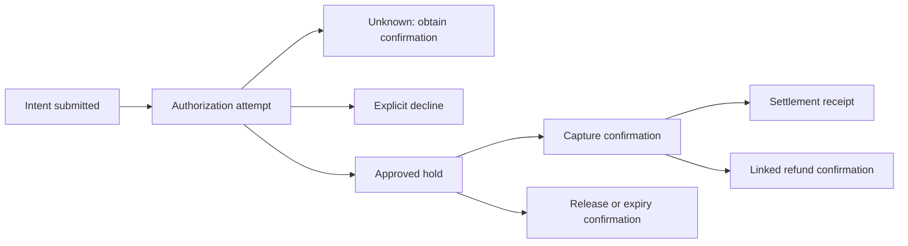

# Synthetic payment lifecycle

Version: `synten-payment-domain/v2`
Authority: [profile](README.md); required [sources](evidence-requirements.md).

These conceptual states govern future corpus language. They are not the incident
states NEW/INVESTIGATING/AWAITING_REVIEW/APPROVED/REJECTED, nor persisted API enums.
Each stage has its own operation identity and independent outcome. A downstream
stage does not overwrite authorization history. Failure, uncertainty and source
disagreement remain distinct.

## Identity and amounts

A tenant-scoped payment intent may have several attempts, each with a request ID,
operation type and idempotency key. Reusing a key with the same canonical payload
refers to the same logical operation; changing its payload is a conflict. A new key
does not establish that repeating a request is safe. Event IDs identify messages,
not necessarily distinct payments. A duplicate delivery is not a duplicate capture.

Amounts are nonnegative integer synthetic units identified as `SYN_UNIT`; no real
currency, exchange, fees or sensitive account identifiers are modeled. Requested
operation amounts must be positive. A declined authorization consumes no authorized
amount. Confirmed captures cannot exceed the confirmed authorization amount;
confirmed refunds cannot exceed confirmed captured amount. Pending amounts reserve
headroom during investigation; they must not be ignored to justify another action.
Partial captures/refunds are distinct linked operations whose sums must be checked.
An apparent invariant breach is a contradiction to investigate, not permission to
rewrite source records. Split tender, incremental authorization and foreign exchange
are outside v2; do not invent them as explanations.

## Stage transitions and confirmation

| Stage | Conceptual transitions | Required confirmation / important boundary |
|---|---|---|
| Intent | CREATED -> SUBMITTED or CANCELLED | Local cancellation before submission; cancellation after submission requires outcome investigation |
| Authorization attempt | REQUESTED -> APPROVED, DECLINED or UNKNOWN; UNKNOWN -> APPROVED or DECLINED with correlated confirmation | Explicit simulated issuer/gateway response; elapsed deadline yields UNKNOWN, never DECLINED |
| Authorized hold | ACTIVE -> PARTIALLY_CONSUMED -> CONSUMED; ACTIVE/PARTIALLY_CONSUMED -> RELEASE_PENDING -> RELEASED; unconsumed portion -> EXPIRED with confirmation | Capture confirmation consumes amount; release/expiry requires downstream record; local elapsed time alone is insufficient |
| Capture operation | REQUESTED -> PENDING, CONFIRMED, FAILED or UNKNOWN; PENDING/UNKNOWN -> CONFIRMED or FAILED | Correlated final acknowledgement; local enqueue/transport error does not establish final outcome |
| Reversal operation | REQUESTED -> PENDING, CONFIRMED, FAILED or UNKNOWN; PENDING/UNKNOWN -> CONFIRMED or FAILED | Confirmed release applies only to unconsumed authorization; it cannot refund a confirmed capture |
| Refund operation | REQUESTED -> PENDING, CONFIRMED, FAILED or UNKNOWN; PENDING/UNKNOWN -> CONFIRMED or FAILED | Linked original capture plus downstream refund confirmation; submission is not completion |
| Settlement batch | OPEN -> CLOSED -> SUBMITTED -> CONFIRMED, FAILED or UNKNOWN; UNKNOWN -> CONFIRMED or FAILED | Exact membership/cutoff and receipt; delayed expected checkpoint is a symptom, not proof of loss |
| Notification delivery | QUEUED -> ATTEMPTING -> ACKNOWLEDGED or RETRY_PENDING; RETRY_PENDING -> ATTEMPTING or EXHAUSTED | Recipient acknowledgement establishes delivery only; exhausted attempts do not alter a payment stage |
| Reconciliation run | COLLECTING -> MATCHED, MISMATCHED or INCOMPLETE | Comparable complete snapshots and matching cutoff; incomplete input cannot establish a financial discrepancy |

REQUESTED may become UNKNOWN when acknowledgement cannot be established. Absence
of confirmation must not be converted to FAILED. Final operation outcomes cannot
silently reverse: a contrary record creates a conflict requiring review. A later
refund or reversal has a separate operation identity and retains earlier history.
Partial consumption is derived from confirmed operations, not a guessed single
payment status. Refund/settlement/notification progress is independently tracked.

The diagram shows stage relationships; the table defines permitted outcomes,
including unknown and failure branches omitted from the compact diagram.

## Time and ordering

Use UTC instants and retain source event time, source sequence/version, received
time and snapshot collection time separately. Transport arrival order does not
determine lifecycle order. Compare versions only within a source's defined stream;
cross-source timestamps alone do not resolve disagreement. Preserve clock uncertainty.

Authorization response deadlines, hold expiry, refund completion expectations,
delivery retry budgets and settlement cutoffs are explicitly versioned synthetic
configuration facts. v2 sets no universal durations: a later source contract must
provide the applicable rule, effective interval and timezone/cutoff interpretation.
If configuration is absent, an analyst cannot assert overdue, expired or safe retry.
Crossing an expected time without final confirmation increases uncertainty and
justifies an evidence request; it does not create a terminal payment outcome.

## Rejections, duplicates and recovery

Locked-card, insufficient-funds and expired-card explanations require explicit
correlated synthetic issuer reasons. A generic decline or gateway error cannot
support those specific claims. Local validation rejection and issuer rejection
have different source authorities. Never infer card/account conditions from a rate.

Compare intent, request, idempotency key, payload identity and confirmed downstream
operation IDs before asserting duplication. Replayed events, two UI entries or
two holds may reflect repeated delivery, projection delay or different attempts.
Even two confirmed operations require evidence that they refer to the same intent
before describing unintended duplication.

Reversal releases an unconsumed hold; refund is a separate operation against a
confirmed capture. Neither is authorized by a report. Retry, replay, correction
or release recommendations require the affected operation's known outcome,
amount headroom, applicable policy and a separately authorized human procedure.
Unknown or contradictory records must remain unresolved when distinguishing
sources cannot be obtained. A useful investigation can identify the exact missing
source and owner without selecting a final cause or action.
