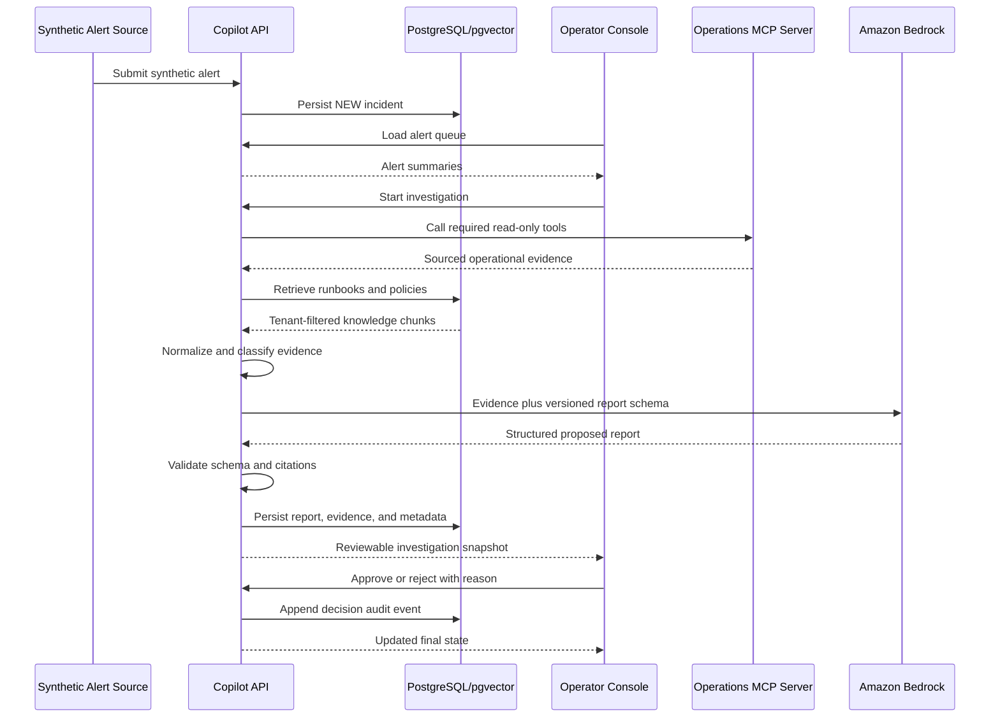

# Architecture

Last reviewed: 2026-08-20

## System boundaries

| Component | Owns | Does not own |
|---|---|---|
| Operator console | Alert and investigation UX, review and decision input | Investigation reasoning or persistence |
| Copilot API | Workflow, persistence, retrieval, report generation, decisions, audit | Synthetic source-system behavior |
| Operations MCP server | Deterministic synthetic operational tools and fixtures | LLM calls or investigation decisions |
| PostgreSQL | Transactional application state and audit records | Unstructured object storage |
| pgvector | Tenant-filtered knowledge chunks and embeddings | Final report truth |
| Amazon Bedrock | Embeddings and structured report generation | Autonomous operational authority |

## End-to-end scenario



## Primary states

Suggested incident lifecycle:

```text
NEW -> INVESTIGATING -> AWAITING_REVIEW -> APPROVED
                                     \-> REJECTED
```

Failure to gather sufficient evidence should remain visible and should not be
misrepresented as a successful investigation.

## Multi-tenant preparation

The MVP exposes one tenant, but tenant identity should remain explicit on
incidents, knowledge, reports, and audit records. Every application query and
vector retrieval must be tenant-scoped. Do not claim production-grade tenant
isolation until it is tested and enforced at every boundary.

## Deployment shape

Keep the initial deployment simple:

- Static Angular application
- One copilot API container
- One synthetic MCP server container
- One managed PostgreSQL instance with pgvector
- Amazon Bedrock through IAM roles

Document the chosen AWS services in an ADR when deployment work begins.
