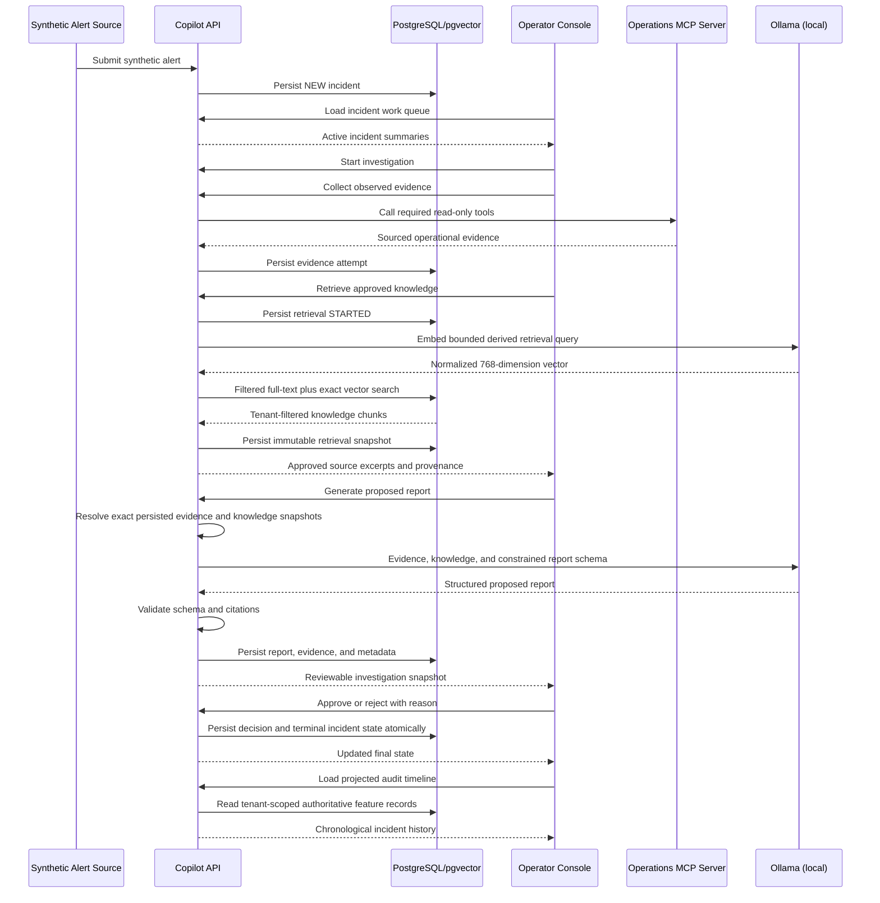

# Architecture

Last reviewed: 2026-09-24

## System boundaries

| Component | Owns | Does not own |
|---|---|---|
| Operator console | Incident work queue, investigation UX, review and decision input | Investigation reasoning or persistence |
| Copilot API | Workflow, persistence, retrieval, report generation, decisions, audit | Synthetic source-system behavior |
| Synthetic incident generator | Generated SynTen alerts and deterministic MCP evidence reconstructed from their opaque `sig-v1` references | Copilot persistence, LLM calls, or investigation decisions |
| Operations MCP server | Legacy deterministic fixtures and independent MCP v1 compatibility verification | Generated `sig-v1` scenario ownership, LLM calls, or investigation decisions |
| PostgreSQL | Transactional application state and audit records | Unstructured object storage |
| pgvector | Tenant-filtered knowledge chunks and embeddings | Final report truth |
| Spring AI provider boundary | Ollama embeddings and report generation locally; optional Bedrock production profile later | Autonomous operational authority |

## Copilot API feature ownership

The copilot API remains one deployable while its implementation is divided into
seven explicit feature areas:

| Feature package | Owns | May depend on |
|---|---|---|
| `incident` | Alert intake, incident and investigation lifecycle, work queue, incident-owned read ports | No other feature package |
| `evidence` | Evidence collection, normalized evidence snapshots, MCP client adapter, evidence persistence and HTTP behavior | Incident read ports only |
| `knowledge.catalog` | Approved source loading, parsing, chunking, hashing, embeddings, ingestion and index writes | No incident or evidence implementation |
| `knowledge.retrieval` | Investigation-time query derivation, search, selection, attempts, history and HTTP behavior | Incident and evidence snapshot ports; catalog-owned index contracts where retrieval requires them |
| `report` | Versioned prompts/schema, strict validation, generation attempts, report persistence and HTTP behavior | Published incident, evidence and retrieval report-snapshot ports only |
| `decision` | Immutable final human decisions, exact-report binding, replay/conflict behavior and decision persistence | Published incident lifecycle/snapshot and report review-candidate ports only |
| `audit` | Tenant-scoped chronological projection and safe timeline HTTP behavior | Published timeline snapshot ports from incident, evidence, retrieval, report and decision only |

Architecture tests enforce the allowed package directions and keep persistence
adapters within their owning features. There is no global common package or
compiled DTO shared across deployables.

Knowledge retrieval composes an incident-owned `InvestigationSnapshot` with an
evidence-owned normalized snapshot before persisting a retrieval attempt. The
incident snapshot exposes only investigation and correlation identifiers,
incident family, title, and description. The evidence snapshot exposes stable
status, service name, and normalized error-code counts while preserving the
difference between the newest attempt and the newest applicable AVAILABLE or
PARTIAL observations. Knowledge persistence never queries or decodes incident
or evidence tables.

Evidence collection obtains tenant-scoped investigation and scenario context
through an incident-owned read port. Its persistence adapter owns only evidence
tables. Tenant identity remains an explicit argument through every application
and persistence port.

## Operator workspace composition

`InvestigationWorkspaceComponent` is the route-level investigation loader and
composition shell. Independently tested observed-evidence, approved-knowledge,
proposed-report, final-decision and audit-timeline panels own their API calls,
models, state, templates, styles, loading and retry behavior. Investigation
lifecycle API code shared by incident detail and the workspace lives under
`core/api/investigations`. Shared presentation is limited to deliberate SCSS
mixins; feature components do not import sibling component stylesheets.

## Synthetic HTTP request context

Application HTTP requests carry tenant identity in
`X-Synthetic-Tenant-Id`. Operator-attributed mutations also carry
`X-Synthetic-Operator-Id`; this includes investigation start, evidence
collection, knowledge retrieval, report generation and a final human decision.
Resource identifiers remain in paths, while tenant and operator identity do not
appear in resource paths, query parameters, or request bodies. A single backend
resolver validates the headers, and a single frontend interceptor attaches
them.

These caller-supplied headers are synthetic demonstration context. They are not
authentication, authorization, or a claim of production-grade tenant security.
Tenant-scoped persistence lookups and indistinguishable cross-tenant not-found
behavior remain mandatory.

## MCP wire contract

The repository owns the immutable
`contracts/mcp/get-recent-service-errors/v1` contract artifact. Its metadata,
input and output JSON schemas, and canonical synthetic fixtures define the wire
contract independently of either Java service's implementation records. A
backward-incompatible change creates `v2`; it does not modify `v1`.

Both Java service test suites load the same artifact. Provider tests compare
live MCP discovery and structured responses semantically with it. Consumer
tests decode the canonical fixtures and reject incompatible payloads. The
copilot API keeps transport failure mapping in its MCP gateway and evidence
payload validation in a typed evidence-owned decoder.

For the one-click SynTen demonstration, the root launcher starts or reuses the
synthetic incident generator before the copilot API and points the API's single
operations MCP connection at port 8082. This preserves the v1 wire contract
while allowing the same service that created an opaque `sig-v1` alert reference
to reconstruct its matching evidence. The fixture-based port-8081 provider
remains independently buildable and runnable, but it is not the evidence source
for generator-created alerts.

## End-to-end scenario



The current local AI flow is:

```text
Spring Boot -> Ollama embeddings -> PostgreSQL/pgvector
Spring Boot -> pgvector retrieval -> Ollama chat model -> report
```

Both paths are implemented. Report generation uses the application-owned
`report-v1` prompt/schema contract and validates every source reference before
persistence. Tests disable chat and embedding provider auto-configuration and
replace model responses with mocks or deterministic doubles.

## Knowledge-source evolution

The catalog supports two legacy repository-owned Markdown sources and the
30 SynTen Inc PDF versions. Parsing, chunking, hashing, embedding, and index
writes remain inside `knowledge.catalog`. Retrieval and report generation
consume persisted catalog records rather than reading PDFs directly or sending
whole documents to a model.

ADR-0009 selects PDFBox 3.0.8 and an immutable page/block representation for
PDF ingestion. A PDF catalog row retains the exact maintained-source and PDF
hashes plus `pdfbox-text-pages/v1`; each `pdf-page-sections/v1` chunk has a
1-based physical page and block range and never crosses a page. Retrieval
snapshots copy that locator rather than resolving it from mutable files.

The catalog can persist a PDF chunk without an embedding, allowing approved
content into lexical retrieval before Ollama is available. Vector ranking
ignores incomplete embedding tuples. K4 recorded embedding those stable chunks
with `nomic-embed-text`. ADR-0011 defines the current query/ranking behavior;
K5 recorded eligible cited guidance in the operator workflow. See
[corpus results and evidence availability](../../SynTen%20Inc/README.md).

Live local-model evaluation is an explicit smoke/evaluation workflow over
synthetic data. Retrieval uses `nomic-embed-text`; report generation uses
`qwen3:8b-q4_K_M` with thinking disabled, temperature zero, no tools, a bounded
output budget, and a context-constrained `report-v1` schema. Application parsing
and citation validation remain authoritative. Model-facing tests use
deterministic doubles and require no live AI provider.

## Primary states

Implemented incident lifecycle:

```text
NEW -> INVESTIGATING -> AWAITING_REVIEW -> APPROVED
                                     \-> REJECTED
```

Failure to gather sufficient evidence should remain visible and should not be
misrepresented as a successful investigation.

## Operator work queue

The MVP uses one tenant-scoped incident work queue rather than separate alert
and investigation queues. `NEW` means unprocessed, not recently received, so an
incident remains visible regardless of age until its state changes.

The same queue retains active incidents as they move through `NEW`,
`INVESTIGATING`, and `AWAITING_REVIEW`. Newly received incidents appear first
by default, and the operator may change the sort without changing queue
membership. `APPROVED` and `REJECTED` incidents are hidden from the default
Active view but remain discoverable through the Completed view in the same
incident surface.

Starting an investigation updates the existing incident row's workflow state;
it does not transfer the incident into a separate list. Queue projections may
carry the active investigation identifier needed for a resume action, but they
must not expose tenant or internal persistence metadata.

## Multi-tenant preparation

The MVP exposes one tenant, but tenant identity remains explicit on incidents,
knowledge, reports, decisions, and audit projections. Every application query
and vector retrieval must be tenant-scoped. Do not claim production-grade
tenant isolation until it is tested and enforced at every boundary.

## Deployment shape

Keep the initial deployment simple:

- Static Angular application
- One copilot API container
- One synthetic MCP server container
- One managed PostgreSQL instance with pgvector
- Optional Amazon Bedrock production profile through least-privilege IAM roles

Local development uses Ollama and never requires AWS credentials. Document and
implement the optional Bedrock profile only when deployment work begins.
