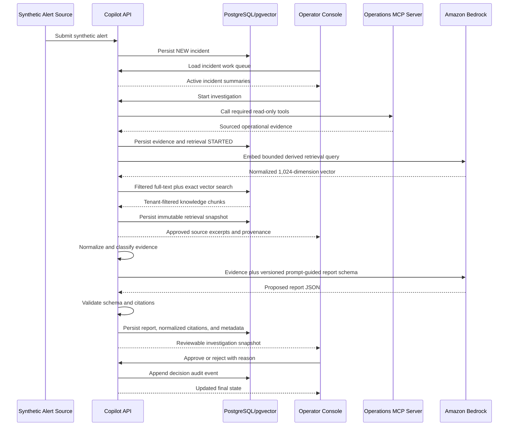

# Architecture

Last reviewed: 2026-08-29

## System boundaries

| Component | Owns | Does not own |
|---|---|---|
| Operator console | Incident work queue, investigation UX, review and decision input | Investigation reasoning or persistence |
| Copilot API | Workflow, persistence, retrieval, report generation, decisions, audit | Synthetic source-system behavior |
| Operations MCP server | Deterministic synthetic operational tools and fixtures | LLM calls or investigation decisions |
| PostgreSQL | Transactional application state and audit records | Unstructured object storage |
| pgvector | Tenant-filtered knowledge chunks and embeddings | Final report truth |
| Amazon Bedrock | Embeddings and prompt-guided report generation | Autonomous operational authority |

## Copilot API feature ownership

The copilot API remains one deployable while its implementation is divided into
five explicit feature areas:

| Feature package | Owns | May depend on |
|---|---|---|
| `incident` | Alert intake, incident and investigation lifecycle, work queue, incident-owned read ports | No other feature package |
| `evidence` | Evidence collection, normalized evidence snapshots, MCP client adapter, evidence persistence and HTTP behavior | Incident read ports only |
| `knowledge.catalog` | Approved source loading, parsing, chunking, hashing, embeddings, ingestion and index writes | No incident or evidence implementation |
| `knowledge.retrieval` | Investigation-time query derivation, search, selection, attempts, history and HTTP behavior | Incident and evidence snapshot ports; catalog-owned index contracts where retrieval requires them |
| `report` | Exact report-input composition, prompt/schema validation, model invocation, append-only attempts, cited report persistence and HTTP behavior | Published incident, evidence and knowledge-retrieval report snapshot ports only |

Architecture tests enforce the allowed package directions and keep persistence
adapters within their owning features. There is no global common package or
compiled DTO shared across deployables.

Knowledge retrieval composes an incident-owned `InvestigationSnapshot` with an
evidence-owned normalized snapshot before persisting a retrieval attempt. The
incident snapshot exposes only investigation and correlation identifiers,
incident family, title, and description. The evidence snapshot exposes stable
status, service name, and normalized error-code counts while preserving the
difference between the newest attempt and the newest applicable AVAILABLE or
PARTIAL observations. Knowledge persistence never queries or decodes incident
or evidence tables.

Evidence collection obtains tenant-scoped investigation and scenario context
through an incident-owned read port. Its persistence adapter owns only evidence
tables. Tenant identity remains an explicit argument through every application
and persistence port.

Report generation composes three narrow tenant-scoped snapshots before it
records `STARTED`: the incident and investigation lifecycle snapshot, the newest
terminal evidence attempt plus newest applicable observations, and the newest
terminal retrieval with its persisted selected chunks. Its persistence adapter
owns only report tables. A validated report update and the incident transition
to `AWAITING_REVIEW` share one transaction; the Bedrock call occurs outside that
transaction. Nova 2 Lite receives a versioned prompt containing the immutable
`report-v1` JSON Schema, and the application independently validates structure,
semantics and source membership before making a report reviewable.

## Operator workspace composition

`InvestigationWorkspaceComponent` is the route-level investigation loader and
composition shell. Independently tested observed-evidence, approved-knowledge,
and report panels own their API calls, models, state, templates, styles, loading
and retry behavior. The report panel follows approved knowledge, labels the
content advisory and unreviewed, and keeps citations beside each claim without
offering decision controls. Investigation lifecycle API code shared by incident
detail and the workspace lives under `core/api/investigations`. Shared
presentation is limited to deliberate SCSS mixins; feature components do not
import sibling component stylesheets.

## Synthetic HTTP request context

Application HTTP requests carry tenant identity in
`X-Synthetic-Tenant-Id`. Operator-attributed mutations also carry
`X-Synthetic-Operator-Id`; investigation start and report generation are the
current operator-attributed mutations.
Resource identifiers remain in paths, while tenant and operator identity do not
appear in resource paths, query parameters, or request bodies. A single backend
resolver validates the headers, and a single frontend interceptor attaches
them.

These caller-supplied headers are synthetic demonstration context. They are not
authentication, authorization, or a claim of production-grade tenant security.
Tenant-scoped persistence lookups and indistinguishable cross-tenant not-found
behavior remain mandatory.

## MCP wire contract

The repository owns the immutable
`contracts/mcp/get-recent-service-errors/v1` contract artifact. Its metadata,
input and output JSON schemas, and canonical synthetic fixtures define the wire
contract independently of either Java service's implementation records. A
backward-incompatible change creates `v2`; it does not modify `v1`.

Both Java service test suites load the same artifact. Provider tests compare
live MCP discovery and structured responses semantically with it. Consumer
tests decode the canonical fixtures and reject incompatible payloads. The
copilot API keeps transport failure mapping in its MCP gateway and evidence
payload validation in a typed evidence-owned decoder.

## End-to-end scenario



## Primary states

Suggested incident lifecycle:

```text
NEW -> INVESTIGATING -> AWAITING_REVIEW -> APPROVED
                                     \-> REJECTED
```

Failure to gather sufficient evidence should remain visible and should not be
misrepresented as a successful investigation.

## Operator work queue

The MVP uses one tenant-scoped incident work queue rather than separate alert
and investigation queues. `NEW` means unprocessed, not recently received, so an
incident remains visible regardless of age until its state changes.

The same queue retains active incidents as they move through `NEW`,
`INVESTIGATING`, and later `AWAITING_REVIEW`. Newly received incidents appear
first by default, and the operator may change the sort without changing queue
membership. When terminal states are implemented, they may be hidden by default
and exposed through a filter or history mode within the same incident surface.

Starting an investigation updates the existing incident row's workflow state;
it does not transfer the incident into a separate list. Queue projections may
carry the active investigation identifier needed for a resume action, but they
must not expose tenant or internal persistence metadata.

## Multi-tenant preparation

The MVP exposes one tenant, but tenant identity remains explicit on
incidents, knowledge, reports, and audit records. Every application query and
vector retrieval must be tenant-scoped. Do not claim production-grade tenant
isolation until it is tested and enforced at every boundary.

## Deployment shape

Keep the initial deployment simple:

- Static Angular application
- One copilot API container
- One synthetic MCP server container
- One managed PostgreSQL instance with pgvector
- Amazon Bedrock through IAM roles

Document the chosen AWS services in an ADR when deployment work begins.
