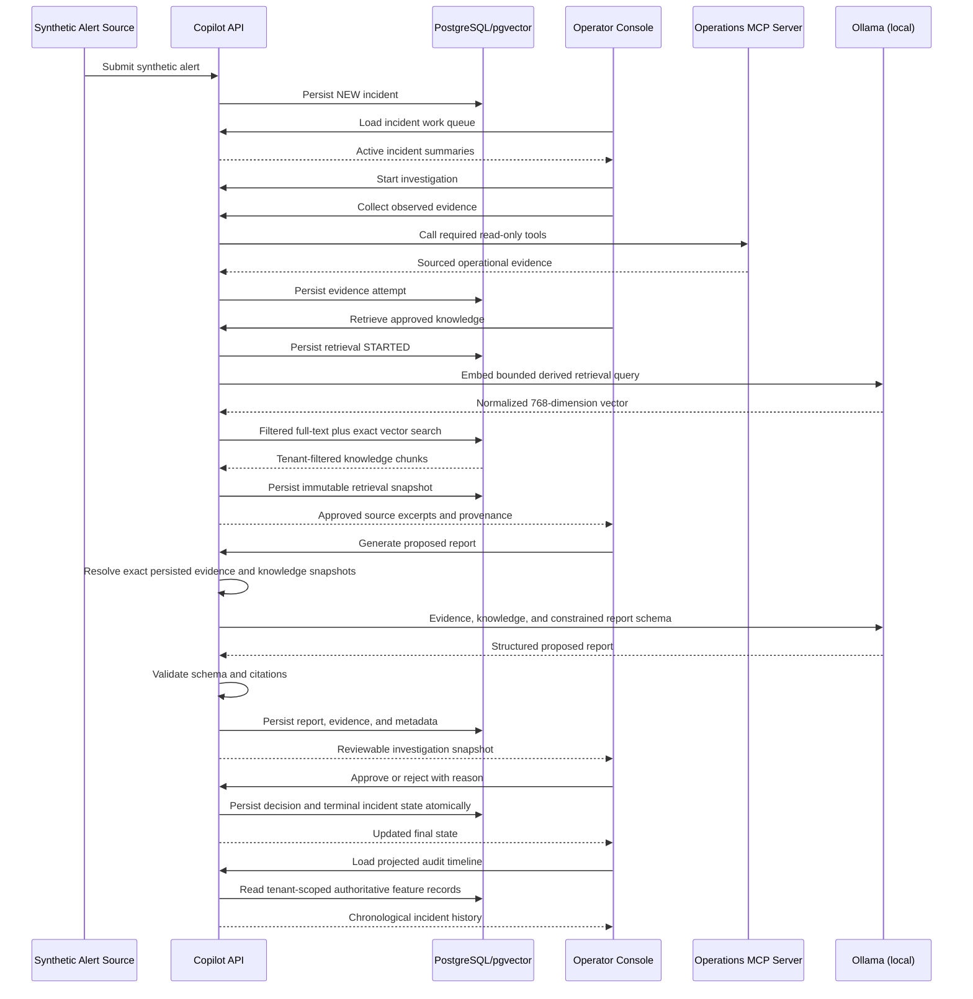

# Architecture

Last reviewed: 2026-10-01

## System boundaries

| Component | Owns | Does not own |
|---|---|---|
| Operator console | Incident work queue, investigation UX, review and decision input | Investigation reasoning or persistence |
| Copilot API | Workflow, persistence, retrieval, report generation, decisions, audit | Synthetic source-system behavior |
| Synthetic incident generator | Generated SynTen alerts, deterministic MCP evidence, gated answer-key reveal and post-decision advisory text comparison | Copilot persistence, report generation or investigation decisions |
| Operations MCP server | Legacy deterministic fixtures and independent MCP v1 compatibility verification | Generated `sig-v1` scenario ownership, LLM calls, or investigation decisions |
| PostgreSQL | Transactional application state and audit records | Unstructured object storage |
| pgvector | Tenant-filtered knowledge chunks and embeddings | Final report truth |
| Spring AI provider boundary | Ollama embeddings and report generation locally; optional Bedrock production profile later | Autonomous operational authority |

## Copilot API feature ownership

The copilot API remains one deployable while its implementation is divided into
seven explicit feature areas:

| Feature package | Owns | May depend on |
|---|---|---|
| `incident` | Alert intake, incident and investigation lifecycle, work queue, incident-owned read ports | No other feature package |
| `evidence` | Evidence collection, normalized evidence snapshots, MCP client adapter, evidence persistence and HTTP behavior | Incident read ports only |
| `knowledge.catalog` | Approved source loading, parsing, chunking, hashing, embeddings, ingestion and index writes | No incident or evidence implementation |
| `knowledge.retrieval` | Investigation-time query derivation, search, selection, attempts, history and HTTP behavior | Incident and evidence snapshot ports; catalog-owned index contracts where retrieval requires them |
| `report` | Versioned prompts/schema, strict validation, generation attempts, report persistence and HTTP behavior | Published incident, evidence and retrieval report-snapshot ports only |
| `decision` | Immutable final human decisions, exact-report binding, replay/conflict behavior and decision persistence | Published incident lifecycle/snapshot and report review-candidate ports only |
| `audit` | Tenant-scoped chronological projection and safe timeline HTTP behavior | Published timeline snapshot ports from incident, evidence, retrieval, report and decision only |

Architecture tests enforce the allowed package directions and keep persistence
adapters within their owning features. There is no global common package or
compiled DTO shared across deployables.

Persistence uses JdbcClient, Hikari and Spring JDBC transactions; Flyway owns
schema evolution. The unused JPA/Hibernate ORM dependency was removed under
[ADR-0022](decisions/ADR-0022-retire-unused-authoring-and-orm.md).

Knowledge retrieval composes an incident-owned `InvestigationSnapshot` with an
evidence-owned normalized snapshot before persisting a retrieval attempt. The
incident snapshot exposes only investigation and correlation identifiers,
incident family, title, and description. The evidence snapshot exposes stable
status, service name, and normalized error-code counts while preserving the
difference between the newest attempt and the newest applicable AVAILABLE or
PARTIAL observations. Knowledge persistence never queries or decodes incident
or evidence tables.

Evidence collection obtains tenant-scoped investigation and scenario context
through an incident-owned read port. Its persistence adapter owns only evidence
tables. Tenant identity remains an explicit argument through every application
and persistence port.

## Operator workspace composition

`InvestigationWorkspaceComponent` is the route-level investigation loader and
composition shell. Independently tested observed-evidence, approved-knowledge,
proposed-report, final-decision and audit-timeline panels own their API calls,
models, state, templates, styles, loading and retry behavior. Investigation
lifecycle API code shared by incident detail and the workspace lives under
`core/api/investigations`. Shared presentation is limited to deliberate SCSS
mixins; feature components do not import sibling component stylesheets.

## Synthetic HTTP request context

Application HTTP requests carry tenant identity in
`X-Synthetic-Tenant-Id`. Operator-attributed mutations also carry
`X-Synthetic-Operator-Id`; this includes investigation start, evidence
collection, knowledge retrieval, report generation and a final human decision.
Resource identifiers remain in paths, while tenant and operator identity do not
appear in resource paths, query parameters, or request bodies. A single backend
resolver validates the headers, and a single frontend interceptor attaches
them.

These caller-supplied headers are synthetic demonstration context. They are not
authentication, authorization, or a claim of production-grade tenant security.
Tenant-scoped persistence lookups and indistinguishable cross-tenant not-found
behavior remain mandatory.

## MCP wire contract

The repository owns the immutable
`contracts/mcp/get-recent-service-errors/v1` contract artifact. Its metadata,
input and output JSON schemas, and canonical synthetic fixtures define the wire
contract independently of either Java service's implementation records. A
backward-incompatible change creates `v2`; it does not modify `v1`.

Both Java service test suites load the same artifact. Provider tests compare
live MCP discovery and structured responses semantically with it. Consumer
tests decode the canonical fixtures and reject incompatible payloads. The
copilot API keeps transport failure mapping in its MCP gateway and evidence
payload validation in a typed evidence-owned decoder.

For the one-click SynTen demonstration, the root launcher starts or reuses the
synthetic incident generator before the copilot API and points the API's single
operations MCP connection at port 8082. This preserves the v1 wire contract
while allowing the same service that created an opaque `sig-v1` alert reference
to reconstruct its matching evidence. The fixture-based port-8081 provider
remains independently buildable and runnable, but it is not the evidence source
for generator-created alerts.

ADR-0019 verifies the effective API MCP endpoint through sanitized actuator info
before local startup succeeds. The launcher starts the selected provider and
rejects mismatched or unverifiable API reuse. Normal random generation selects
only AVAILABLE scenarios while preserving explicit degraded evaluation fixtures.

## End-to-end scenario


```mermaid
sequenceDiagram
    participant S as Synthetic Alert Source
    participant A as Copilot API
    participant D as PostgreSQL/pgvector
    participant U as Operator Console
    participant M as Operations MCP Server
    participant O as Ollama (local)

    S->>A: Submit synthetic alert
    A->>D: Persist NEW incident
    U->>A: Load incident work queue
    A-->>U: Active incident summaries
    U->>A: Start investigation
    U->>A: Collect observed evidence
    A->>M: Call required read-only tools
    M-->>A: Sourced operational evidence
    A->>D: Persist evidence attempt
    U->>A: Retrieve approved knowledge
    A->>D: Persist retrieval STARTED
    A->>O: Embed bounded derived retrieval query
    O-->>A: Normalized 768-dimension vector
    A->>D: Filtered full-text plus exact vector search
    D-->>A: Tenant-filtered knowledge chunks
    A->>D: Persist immutable retrieval snapshot
    A-->>U: Approved source excerpts and provenance
    U->>A: Generate proposed report
    A->>A: Resolve exact persisted evidence and knowledge snapshots
    A->>O: Evidence, knowledge, and constrained report schema
    O-->>A: Structured proposed report
    A->>A: Validate schema and citations
    A->>D: Persist report, evidence, and metadata
    A-->>U: Reviewable investigation snapshot
    U->>A: Approve or reject with reason
    A->>D: Persist decision and terminal incident state atomically
    A-->>U: Updated final state
    U->>A: Load projected audit timeline
    A->>D: Read tenant-scoped authoritative feature records
    A-->>U: Chronological incident history
```

The current local AI flow is:

```text
Spring Boot -> Ollama embeddings -> PostgreSQL/pgvector
Spring Boot -> pgvector retrieval -> Ollama chat model -> report
```

Both paths are implemented. Report generation uses the application-owned
`report-v1` prompt/schema contract and validates every source reference before
persistence. Tests disable chat and embedding provider auto-configuration and
replace model responses with mocks or deterministic doubles.

Under [ADR-0017](decisions/ADR-0017-degraded-evidence-report-constraints.md), a
latest evidence status other than AVAILABLE or an empty observation snapshot
requires INSUFFICIENT_EVIDENCE, LOW confidence, null cause/recommendation and an
explicit gap. report-prompt/v5 and the provider's per-context schema constrain
generation; independent parsing rejects violations as MALFORMED. Earlier applicable
observations remain cited history and cannot restore current sufficiency.

[ADR-0024](decisions/ADR-0024-attainable-high-confidence.md) supersedes the
v6 aggregate-only confidence ceiling. report-prompt/v7 permits LOW/MEDIUM/HIGH
for AVAILABLE evidence, normally favors MEDIUM, and reserves HIGH for unusually
substantial, direct, consistent support of a narrow observed mechanism. Missing
independent confirmation makes HIGH exceptional but does not prohibit it.
Rationale preserves the uncertainty; HIGH does not confirm a deeper cause or
final outcome. Degraded/empty evidence still independently requires LOW/null.
Structural validation cannot prove semantic support or guarantee a distribution.
Historical reports and comparisons remain unchanged. New post-decision confidence
expectations follow ADR-0025; report generation remains governed by ADR-0024.

O3 versions generation to report-prompt/v8. Instructions request causes bounded
to observed failure mechanisms and explicitly unverified deeper configuration/
capacity/dependency hypotheses. Recommendations should request owners and stage-specific
records from supplied guidance, preserve unknown final outcomes and include
applicable retry prerequisites. Missing guidance stays visible. Existing structural
validation remains authoritative; no semantic prose checker or output repair is
added. Human review precedes any operational action. Live adherence remains
limited; passing prompt tests do not establish supported prose.

[ADR-0026](decisions/ADR-0026-report-context-and-cancellation.md) sets the report
context to 8,192 tokens and sends top-level truncate=false/shift=false through a
Spring AI 2.0 compatibility codec. Oversized context fails closed. Internal
reactive generation is cancelled on deadline/interruption; only a completed stop
response is assembled for existing validation and one terminal HTTP response.
V12 retains versioned context/transport settings on new attempts with historical
NULLs. The two-minute deadline, output budget, model and v8 prompt remain.
[ADR-0028](decisions/ADR-0028-report-deadline-and-gpu-tuning.md) supersedes the
previous deadline with a 150-second default and maximum. Report-only execution
options expose automatic or explicit GPU layer placement and a 128-token default
processing batch. The installed model, 8,192-token context, precision, prompt,
1,536 output-token budget and validation remain unchanged. New v3 settings retain
effective GPU/batch options; absent historical options remain unknown. The measured
35-layer workstation setting is local configuration, not a portable GPU assumption.
The local embedding residency setting is 0s to free GPU memory after retrieval;
the portable default remains 5m. An explicit provider-specific embedding request
preserves this option through Spring AI 2.0 without changing query/vector semantics.

## Knowledge-source evolution

Under [ADR-0021](decisions/ADR-0021-post-decision-text-comparison.md), the
standalone generator automatically compares the exact decision-bound report
after reveal. Its independently prompted local Ollama judge scores only cause
and recommendation text; disposition, confidence, averages, bands and human
decision match use code. Tenant-scoped read-only API inputs and unique local
artifacts preserve comparison provenance. This post-decision boundary cannot
feed oracle content back into the evaluated workflow or change its outputs.

[ADR-0025](decisions/ADR-0025-evidence-based-confidence-expectations.md) adds
confidence-evidence/v1: deterministic rules evaluate the exact latest operational
snapshot and required machine signals independently of actual report confidence.
LOW covers weak/degraded support; MEDIUM covers bounded candidate mechanisms;
HIGH requires one of three explicit consistent direct diagnostic signatures.
No independent confirmation is mandatory. comparison-rubric/v2 retains exact
0/100 checks, weights, bands and approval formula, changing only confidence's
expected input. UI/artifacts retain original and calibrated levels plus rationale
and version. Original keys, historical artifacts and offline grading remain intact.

The catalog retains historical Markdown inputs, the 30 authorization PDFs and
the frozen 16 payment PDFs. New operational searches use only accepted PDFs
with declared family applicability, including shared policies (ADR-0020).
Explicit preparation imports/embeds each catalog; ordinary local startup checks
both exact persisted plans and complete compatible vectors without importing.
Parsing, chunking, hashing, embedding, and index
writes remain inside `knowledge.catalog`. Retrieval and report generation
consume persisted catalog records rather than reading PDFs directly or sending
whole documents to a model.

ADR-0009 selects PDFBox 3.0.8 and an immutable page/block representation for
PDF ingestion. A PDF catalog row retains the exact maintained-source and PDF
hashes plus `pdfbox-text-pages/v1` for the baseline or `pdfbox-payment-pages/v1`
for the independent library; each `pdf-page-sections/v1` chunk has a
1-based physical page and block range and never crosses a page. Retrieval
snapshots copy that locator rather than resolving it from mutable files.

Reviewer PDF links use the persisted PDF SHA-256 as the sole resource
identifier. `GET /api/knowledge/pdf-artifacts/{sha256}` resolves only packaged
synthetic PDFs from the active and archived corpus versions, rechecks the
content hash while building the in-memory catalog, and returns the immutable
bytes inline. The operator console appends the persisted physical page as a PDF
fragment; tenant identity, filesystem paths, and mutable filenames are not part
of the resource URL.

The catalog can persist a PDF chunk without an embedding, allowing approved
content into lexical retrieval before Ollama is available. Vector ranking
ignores incomplete embedding tuples. K4 recorded embedding those stable chunks
with `nomic-embed-text`. ADR-0011 defines `knowledge-query/v2` and the original
type-balanced search; [ADR-0015](decisions/ADR-0015-source-derived-retrieval-signals-and-relationships.md)
defines current `postgres-hybrid-related/v4` ranking. Exact machine-token
matches precede generic prose, with a bounded lexical preference and RRF.
V10 persists source-derived document keys/relationships; explicit corpus
reimport populates them on hash-matching existing versions without changing
chunks or embeddings. Up to four ranked runbooks anchor at most two relationship
edges to eligible policies. Missing/ambiguous keys are not traversed, and all
existing tenant, approval, effective-time, family and relevance filters apply.
The union permits up to 80 direct plus 20 related candidates while the final
context remains four runbooks and three policies. Selected-result JSONB and
evaluation candidates retain exact-signal counts and the chosen relationship
path with immutable source-version/hash provenance. Historical snapshots keep
null relationship evidence. K5 recorded eligible cited guidance in the operator workflow. See
[corpus results and evidence availability](../../SynTen%20Inc/README.md).

Live local-model evaluation is an explicit smoke/evaluation workflow over
synthetic data. Retrieval uses `nomic-embed-text`; report generation uses
`qwen3:8b-q4_K_M` with thinking disabled, temperature zero, no tools, a bounded
output budget, and a context-constrained `report-v1` schema. Application parsing
and citation validation remain authoritative. Model-facing tests use
deterministic doubles and require no live AI provider.

Report-quality grading is a separate offline repository workflow defined by
ADR-0016. `synten-report-eval/v1` reads a completed 36-scenario run, the
observable catalog, and the sealed oracle only after generation. It has no
runtime route, persistence access, model call, or dependency from report
generation. Its retained artifact binds evaluator, input, catalog, and oracle
bytes by SHA-256 and reports exact correctness checks, citation membership,
bounded unsupported-claim indicators, terminal outcomes, and latency. These
bounded checks do not claim general natural-language entailment.

## Primary states

Implemented incident lifecycle:

```text
NEW -> INVESTIGATING -> AWAITING_REVIEW -> APPROVED
                                     \-> REJECTED
```

Failure to gather sufficient evidence should remain visible and should not be
misrepresented as a successful investigation.

## Operator work queue

The MVP uses one tenant-scoped incident work queue rather than separate alert
and investigation queues. `NEW` means unprocessed, not recently received, so an
incident remains visible regardless of age until its state changes.

The same queue retains active incidents as they move through `NEW`,
`INVESTIGATING`, and `AWAITING_REVIEW`. Newly received incidents appear first
by default, and the operator may change the sort without changing queue
membership. `APPROVED` and `REJECTED` incidents are hidden from the default
Active view but remain discoverable through the Completed view in the same
incident surface.

Starting an investigation updates the existing incident row's workflow state;
it does not transfer the incident into a separate list. Queue projections may
carry the active investigation identifier needed for a resume action, but they
must not expose tenant or internal persistence metadata.

## Multi-tenant preparation

The MVP exposes one tenant, but tenant identity remains explicit on incidents,
knowledge, reports, decisions, and audit projections. Every application query
and vector retrieval must be tenant-scoped. Do not claim production-grade
tenant isolation until it is tested and enforced at every boundary.

## Deployment shape

Keep the initial deployment simple:

- Static Angular application
- One copilot API container
- One synthetic MCP server container
- One managed PostgreSQL instance with pgvector
- Optional Amazon Bedrock production profile through least-privilege IAM roles

Local development uses Ollama and never requires AWS credentials. Document and
implement the optional Bedrock profile only when deployment work begins.

## Additional synthetic incident families

[ADR-0018](decisions/ADR-0018-additive-incident-families.md) extends typed alert
intake to seven families with a backward-compatible omitted-type default. The
generator composes the original catalog with twelve additive scenarios under
[SynTen multi-incidents v1](../../SynTen%20Inc/multi-incidents/v1/README.md).
Family-specific service errors use the unchanged MCP v1 contract. Twelve
approved Markdown runbooks/policies remain immutable historical inputs with
line/source metadata. ADR-0020 replaces operational preparation with both
accepted PDF catalogs and PDF-only multi-family/shared-policy retrieval. Reports,
human decisions and audit retain their existing boundaries. No payment engines,
new infrastructure or automated operational actions are introduced.
