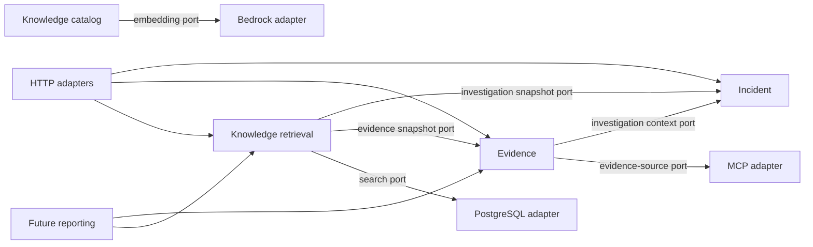

# Codebase boundary and leanness findings

Reviewed: 2026-08-28
Scope: Entire tracked product codebase plus the approved-knowledge working tree
Purpose: Identify unclear ownership, dependency direction, module sizing, and
avoidable maintenance weight
Change policy: Findings only; no production code was changed as part of this
review

## Executive conclusion

The three deployable application boundaries are appropriate and should remain:

- `frontend/operator-console`
- `backend/copilot-api`
- `backend/operations-mcp-server`

The repository does not need more deployables or broad shared-code modules.
The main boundary risk is inside the copilot API and investigation workspace.
The API has 108 main Java types, but 107 of them are divided between only two
flat feature packages: 55 under `incident` and 52 under `knowledge`. Those
packages now contain HTTP contracts, workflows, domain state, persistence,
external adapters, parsing, and configuration side by side. The Angular
investigation workspace similarly owns investigation loading, evidence
collection, knowledge retrieval, and their complete presentations in one
component.

The most important correction is to establish a few feature-level internal
modules with explicit read ports between them. In particular, knowledge
retrieval should not read incident and evidence tables or deserialize evidence
types directly. The next report-generation slice will otherwise depend on the
same database details and make those implicit boundaries harder to unwind.

There are also straightforward ways to make the repository leaner: remove
unused JPA and Angular Forms dependencies, verify whether validation is needed
in the MCP server, consolidate repeated PostgreSQL test setup, and include the
frontend in CI.

## Review method and limits

This was a static dependency and responsibility review of:

- Maven/npm module definitions and dependencies
- Java packages, imports, Spring roles, services, repositories, adapters, and
  public records
- Angular routes, feature imports, API services, models, components, templates,
  styles, and tests
- Flyway migrations and database ownership
- MCP tool contracts and client-side decoding
- Docker, local startup, and CI entry points
- Existing architecture records and product constraints

The review included the uncommitted approved-knowledge implementation already
present on `codex/approved-knowledge-retrieval`. It did not use runtime
profiling, production traffic, or AWS observations. Suggested changes are not
authorization to modify the active task contract.

## Current module snapshot

| Area | Current size and shape | Assessment |
|---|---|---|
| Copilot API deployable | One Spring Boot application; 108 main Java files | Correct deployable size for the MVP |
| `incident` package | 55 Java files, about 1,642 lines | Too broad: alert intake, incident lifecycle, investigation, evidence, MCP adapter, persistence, and web errors |
| `knowledge` package | 52 Java files, about 2,297 lines | Too broad: source loading, Markdown parsing, chunking, embeddings, indexing, search, retrieval workflow, HTTP, and persistence |
| Operations MCP server | One Spring Boot application with one tool and readable fixtures | Appropriately small and cohesive today |
| Operator console | Three route features plus core/shared support | Deployable boundary is good; workspace feature is becoming oversized |
| Investigation workspace | About 120 TypeScript, 348 template, 229 style, and 429 test lines | Already contains three independent asynchronous workflows; report/decision work would make it too large |
| Database | One API-owned Flyway history and PostgreSQL schema | Correct ownership; some repository queries cross intended feature boundaries |
| CI | Maven reactor only | Does not verify the independently buildable frontend boundary |

File and line counts are sizing signals, not automatic reasons to split. A
large cohesive algorithm can be clearer than several tiny classes. The
recommendations below are based on different reasons to change, different I/O
boundaries, or dependency direction—not line count alone.

## Boundaries worth preserving

1. Keep the operator console, copilot API, and operations MCP server as three
   independently deployable applications. ADR-0001 remains a good fit.
2. Keep PostgreSQL and pgvector inside the copilot API's persistence boundary.
   A separate search service is not warranted for the current corpus.
3. Keep the operations MCP server deterministic, synthetic, and read-only. Do
   not move investigation reasoning into it.
4. Keep repository interfaces in front of JDBC implementations. They make
   workflow tests fast and preserve adapter replaceability.
5. Keep the small transaction-boundary services around evidence and knowledge
   attempts. `STARTED` must commit before MCP or Bedrock calls, so collapsing
   those wrappers into one transactional workflow would be a regression.
6. Keep frontend queue and incident-detail read models distinct. They serve
   different screens even when several fields overlap.
7. Do not create a cross-service Java DTO jar. MCP and HTTP are runtime
   contracts between independently deployable applications; sharing compiled
   implementation types would hide compatibility problems.

## Recommended target shape

Use package-level modules inside the existing deployables. New Maven modules or
services should require a measured release, security, scaling, or ownership
need.

```text
backend/copilot-api
  incident                 alert intake, incident state, queue/detail, investigation lifecycle
  evidence                 evidence attempts, evidence snapshots, MCP collection port
  knowledge/catalog        approved sources, parsing, chunking, embedding, index writes
  knowledge/retrieval      query derivation, hybrid search, selection, attempts/history API
  api/support              only narrow HTTP concerns shared by multiple features
  reporting                future slice; consumes published snapshots/identifiers

frontend/operator-console
  features/incident-work-queue
  features/incident-detail
  features/investigation-workspace
    investigation-summary
    observed-evidence
    approved-knowledge
    report-review           future
  core/api                  public clients used by more than one route feature

backend/operations-mcp-server
  recent-service-errors     current tool and fixture adapter
  <one package per future tool or cohesive tool family>
```

The intended dependency direction is:



Adapters should implement inward-facing ports. Domain records and workflows
should not reference concrete `SpringAi*`, `Mcp*`, or `Postgres*` classes.

## Prioritized findings

| ID | Priority | Finding | Recommended outcome |
|---|---|---|---|
| B01 | High | Copilot API packages are too broad to act as clear module boundaries | Establish `incident`, `evidence`, `knowledge/catalog`, and `knowledge/retrieval` ownership |
| B02 | High | Knowledge retrieval reaches through incident and evidence persistence | Replace table/type reach-through with narrow investigation/evidence snapshot ports |
| B03 | High | The Angular investigation workspace owns too many independent concerns | Make the route component a composition shell with evidence and knowledge panels |
| B04 | High | Tenant identity has no single HTTP/application boundary | Choose one tenant-context convention before authentication/report work expands |
| B05 | High | Frontend is independently buildable but absent from CI | Add frontend install, test, format, and build to the authoritative verification boundary |
| B06 | Medium | MCP contract ownership is implicit and duplicated | Keep services independent but add one versioned wire schema/contract fixture |
| B07 | Medium | Application records depend on concrete adapters for metadata | Inject provider/tool descriptors through ports or configuration-owned value objects |
| B08 | Medium | HTTP validation and problem handling are duplicated and partially discarded | Centralize narrow web support and preserve structured error information in the console |
| B09 | Medium | Correlation exists in data but not across logs and HTTP errors | Propagate a request/investigation correlation identifier through diagnostic boundaries |
| B10 | Medium | A few classes combine unrelated persistence or decoding responsibilities | Split by I/O/change reason, not by arbitrary line limits |
| B11 | Low | Naming and projections carry earlier slice terminology | Align `alert-queue` and queue-specific projections with the incident work queue vocabulary |
| B12 | Low | Several dependencies and test helpers add avoidable weight | Remove verified-unused dependencies and consolidate repeated test infrastructure |

## Detailed findings

### B01 — Copilot API packages are too broad

Priority: High

Evidence:

- `backend/copilot-api/src/main/java/.../incident/` contains 55 main Java
  files. It includes alert intake, queue/detail reads, investigation state,
  evidence collection, MCP transport/decoding, JDBC repositories, HTTP
  controllers, and exception advice.
- `backend/copilot-api/src/main/java/.../knowledge/` contains 52 main Java
  files. It includes source repositories, metadata parsing, section parsing,
  chunking, hashing, Bedrock embedding, index writes, hybrid search, retrieval
  lifecycle, HTTP responses, JDBC repositories, and exception advice.
- Public visibility does not identify an intentional module API. For example,
  `Incident`, `IngestAlertCommand`, HTTP response records, evidence content,
  and enums are all public in the same package.

Why the boundary is unclear:

- Java package privacy is the current compile-time boundary, but each package
  is now large enough that unrelated workflows can reach one another's
  internals.
- A maintainer cannot infer whether a type is domain state, an HTTP contract,
  a cross-feature contract, or an adapter model from its package.
- Future reporting will be tempted to import whatever is convenient from both
  packages, growing an implicit shared domain.

Recommendation:

- Move evidence collection into an `evidence` feature module.
- Divide knowledge by its two lifecycles: `knowledge.catalog` for ingestion and
  indexing, and `knowledge.retrieval` for investigation-time retrieval.
- Expose one or two narrow application interfaces/value projections per module;
  keep other types package-private.
- Add an architecture test only after the target package map is agreed. Enforce
  allowed directions rather than merely checking naming conventions.

Avoid:

- A global `domain`, `service`, `repository`, or `common` package.
- One Maven module per small feature. Package-level enforcement is enough at
  this size.

### B02 — Knowledge retrieval reaches through incident and evidence storage

Priority: High

Evidence:

- `PostgresKnowledgeRetrievalRepository.java:34-76` joins `investigation`,
  `incident`, and `evidence_collection_attempt` to build retrieval context.
- The same query hard-codes the tool name `getRecentServiceErrors` at lines 55
  and 64.
- The repository imports `EvidenceCollectionStatus`, `IncidentType`, and
  `ServiceErrorEvidenceContent`, then deserializes evidence JSON itself at
  lines 172-190 and 360-366.
- `KnowledgeRetrievalContext` and `KnowledgeEvidenceReference` directly expose
  incident/evidence package types to the knowledge package.

Why the boundary is unclear:

- A knowledge persistence adapter currently owns a read model spanning three
  feature schemas and an evidence payload schema.
- Changes to evidence JSON, tool selection, or incident storage require changes
  in the knowledge repository even if retrieval behavior is unchanged.
- Future reporting could repeat these joins instead of consuming stable,
  application-owned snapshots.

Recommendation:

- Let the incident module publish an `InvestigationSnapshot` query port with
  tenant, investigation/correlation identifiers, incident family, title, and
  description.
- Let the evidence module publish a `LatestApplicableEvidenceSnapshot` query
  port containing only normalized retrieval inputs and evidence identifiers.
- Have the retrieval workflow compose those two ports. Its PostgreSQL adapter
  should own only knowledge/retrieval tables.
- Keep tenant checks inside every providing module; do not return an unscoped
  aggregate and filter it later.

This is the highest-value boundary correction before report generation.

### B03 — The Angular investigation workspace owns too many concerns

Priority: High

Evidence:

- `investigation-workspace.component.ts:24-33` holds separate investigation,
  evidence, and knowledge state machines.
- Lines 39-124 load the investigation, load/collect evidence, and load/retrieve
  knowledge.
- The component template is about 348 lines and its spec is about 429 lines.
- `investigation.models.ts` combines investigation, evidence, and knowledge
  HTTP contracts.
- `InvestigationApiService` owns investigation lifecycle, evidence collection,
  and knowledge retrieval endpoints.
- `incident-detail.component.ts:6` imports that API service from the sibling
  `investigation-workspace` feature to start an investigation.
- `investigation-workspace.component.ts:13-16` directly loads the incident
  detail feature's SCSS file.

Why the boundary is unclear:

- The route component is both page coordinator and complete presentation for
  two independently retryable histories.
- A sibling route feature depends on an API service owned by the workspace
  directory.
- Styling ownership crosses feature directories without a shared component or
  shared presentation contract.
- Adding report generation and human decision states to this component would
  make failures harder to isolate and tests increasingly fixture-heavy.

Recommendation:

- Keep `InvestigationWorkspaceComponent` as a route-level composition shell.
- Extract `ObservedEvidencePanel` and `ApprovedKnowledgePanel` as cohesive
  components, each owning its API state, retry behavior, view model, template,
  styles, and focused tests.
- Put investigation lifecycle API calls used by multiple route features under
  `core/api/investigations`, or expose a deliberately public feature API.
- Move genuinely shared incident-card styles into one shared presentation
  partial/component; do not import another feature's component stylesheet.
- Add the future report review as another panel rather than another branch in
  the existing 348-line template.

Avoid splitting every status badge, provenance row, or button into a component.
The useful unit is one independently loading/retrying panel.

### B04 — Tenant identity has no single boundary convention

Priority: High

Evidence:

- Alert ingestion receives tenant identity in the request payload.
- The queue uses `/api/tenants/{tenantId}/incidents`.
- Incident detail, investigation, evidence, and knowledge APIs use a
  `tenantId` query parameter.
- Angular services repeat `SYNTHETIC_TENANT_ID` and construct tenant parameters
  independently.
- The frontend also supplies the synthetic operator identifier when starting
  an investigation.

Why the boundary is unclear:

- Tenant identity is application security context, resource identity, and
  request data depending on the endpoint.
- Authentication will need to replace client-asserted identity. Inconsistent
  conventions increase the chance that one path remains caller-controlled.
- Debugging cross-tenant behavior requires knowing a different lookup rule for
  each endpoint family.

Recommendation:

- Before authentication work, record one API decision for tenant and operator
  context.
- Prefer authenticated/request context as the authority when identity exists;
  path identifiers may identify resources but must be checked against that
  context.
- Until then, centralize synthetic tenant/operator configuration in one API
  client boundary without hiding the server-side tenant checks.
- Add a dependency rule that all persistence/query ports require explicit
  tenant context even after HTTP extraction is centralized.

### B05 — CI does not cover every deployable boundary

Priority: High

Evidence:

- `.github/workflows/ci.yml:21-22` runs only `mvn --batch-mode clean verify`.
- The Angular application has independent `npm ci`, test, formatting, and build
  requirements, but no CI job executes them.
- Local verification is distributed between `QUALITY.md`, the README, and a
  Windows launcher; the proposed authoritative verification task acknowledges
  this gap.

Why the boundary is unclear:

- ADR-0001 says each application remains independently buildable and
  deployable, but the repository's automated acceptance boundary covers only
  the two Java applications.
- Cross-layer contract changes can merge with a green CI result while the
  operator console is broken.

Recommendation:

- Implement the already-proposed authoritative verification entry point.
- Give backend and frontend separate CI jobs for useful failure isolation, then
  make the required aggregate result depend on both.
- Keep deployment builds separate even if local orchestration offers one
  convenience command.

### B06 — The MCP contract is implicit and duplicated

Priority: Medium

Evidence:

- `RecentServiceErrorsTool.java:13-15` owns source, tool, and schema-version
  constants in the MCP server.
- `McpServiceErrorEvidenceGateway.java:15-30` duplicates those values and the
  exact expected field sets in the API.
- `RecentServiceErrorsClient` returns `Map<String, Object>` and
  `SpringAiRecentServiceErrorsClient.java:43-65` passes untyped structured
  content to a roughly 260-line validator/decoder.
- The MCP contract test validates the server schema, while API tests separately
  encode the consumer's expectations.

Why the boundary is unclear:

- There is no single versioned artifact that describes what provider and
  consumer agree on.
- The current strict decoder is safe, but compatibility depends on duplicated
  string constants and field lists.
- Adding another MCP tool will copy this pattern and grow the `incident`
  package further.

Recommendation:

- Keep provider and consumer implementation types separate.
- Add a small versioned contract artifact, such as JSON Schema or a canonical
  MCP contract fixture, that both service test suites verify.
- Move wire decoding to the MCP adapter and return a typed evidence-source
  result through the application port.
- Use one package per tool or cohesive tool family once a second tool arrives.

### B07 — Application records depend on concrete adapter metadata

Priority: Medium

Evidence:

- `KnowledgeRetrievalAttempt.java:56-57` reads model ID and dimensions from
  `SpringAiTitanKnowledgeEmbeddingClient`.
- `EvidenceCollectionService.java:38-42` reads source system, tool name, and
  schema version from `McpServiceErrorEvidenceGateway`.
- The embedding smoke command also validates against concrete adapter static
  constants.

Why the boundary is unclear:

- The workflow/domain layer depends outward on implementation classes named
  after Spring AI and MCP.
- A deterministic test adapter or future provider can supply data while the
  persisted audit metadata still comes from a different concrete adapter.
- Configuration and audit metadata ownership are difficult to locate.

Recommendation:

- Define immutable `EmbeddingProfile` and `EvidenceSourceDescriptor` values at
  the inward-facing port boundary.
- Have the selected adapter/configuration provide those descriptors.
- Build attempt metadata from the active port descriptor, not a concrete class.
- Keep model/tool version values centralized and persisted exactly as today.

### B08 — HTTP boundary support is duplicated and loses useful detail

Priority: Medium

Evidence:

- UUID parsing is repeated in investigation, incident detail, evidence, and
  knowledge controllers.
- `ApiExceptionHandler` and `KnowledgeApiExceptionHandler` both create the same
  investigation validation and not-found Problem Details with separate local
  `FieldValidationError` records.
- The knowledge package defines its own invalid-request and investigation-
  not-found exceptions for equivalent HTTP outcomes.
- `api-error.interceptor.ts:4-22` reduces every backend Problem Detail to a
  generic message plus status code.

Why the boundary is unclear:

- Feature packages partly own web policy, but several errors describe the same
  top-level investigation resource.
- The server emits structured diagnostic information that the console discards.
- Adding report and decision endpoints will likely create more parsers, advice,
  and frontend boolean error flags.

Recommendation:

- Create one narrow `api.support` boundary for identifier parsing, standard
  field-error shape, and shared resource errors.
- Keep feature-specific error types and messages inside features; centralize
  only the repeated HTTP mechanics.
- Parse and preserve safe Problem Detail fields in `ApiRequestError`, including
  problem type and safe validation fields.
- Do not introduce a generic exception hierarchy that hides meaningful domain
  outcomes.

### B09 — Correlation data is persisted but not available end to end

Priority: Medium

Evidence:

- Investigation correlation IDs are persisted and passed through evidence and
  retrieval records.
- MCP requests and results verify correlation and tool-call IDs.
- Application request paths have no correlation filter/interceptor, MDC fields,
  response header, or Problem Detail correlation property.
- Apart from explicit ingestion/smoke commands, application workflows have no
  structured diagnostic logging.

Why the boundary is unclear:

- The data model has an audit correlation boundary, while operational
  diagnostics have a separate, mostly absent boundary.
- An operator-visible failed request cannot be tied directly to service logs or
  its persisted `STARTED` attempt without manual database inspection.

Recommendation:

- Establish a request correlation identifier at the HTTP boundary and include
  it in structured logs and safe error responses.
- When an investigation exists, log both request correlation and investigation
  correlation as distinct fields.
- Log state transitions and external-call outcomes using identifiers and
  statuses, never full prompts, evidence payloads, or raw knowledge content.

### B10 — Some large classes have multiple reasons to change

Priority: Medium

`PostgresKnowledgeRetrievalRepository` is about 390 lines and owns:

- incident/evidence context reads
- attempt inserts and completion updates
- result inserts
- history loading
- JSON serialization for filters and evidence
- JDBC row mapping and utility conversion

Its history method also loads results once per attempt (`findAll` calls
`findResults` for each row), making persistence behavior harder to reason about
as history grows.

Recommended split:

- Move investigation/evidence context reads behind the feature ports described
  in B02.
- Keep one retrieval-attempt store for command operations.
- Use one history query/read repository that loads attempts and results in a
  bounded number of queries.

`McpServiceErrorEvidenceGateway` is about 260 lines and owns both availability
translation and the full nested wire decoder. Keep the transport client
separate, but extract one typed payload decoder/validator so tool compatibility
has a single testable home.

`MarkdownKnowledgeChunker` is about 310 lines and performs Markdown section
discovery, block packing, overlap/hard-limit splitting, embedding-input
construction, and hashing. It is cohesive enough to keep for now. Split it only
if the algorithm changes again; the most natural two units would be Markdown
section extraction and section-to-chunk packing. Do not fragment individual
range/hash helpers into standalone classes.

`PostgresKnowledgeSearchRepository` contains a long but cohesive SQL ranking
algorithm. Keeping the SQL next to its parameter binding and result mapping is
currently clearer than moving it into a generic query-file framework.

### B11 — Naming and projection ownership have drifted

Priority: Low

Evidence:

- Product language consistently says “incident work queue,” while the Angular
  feature remains `alert-queue` with `AlertQueueComponent`,
  `AlertQueueApiService`, and `AlertQueueItem`.
- `IncidentDetailResponse.from(...)` consumes `IncidentWorkQueueEntry`; the
  detail screen therefore depends on a projection named for the queue.
- Both queue and detail components hard-code the label “Authorization decline
  spike” instead of mapping the `IncidentType` value once.

Recommendation:

- Rename the frontend feature to `incident-work-queue` when next touched.
- Rename the shared backend projection to describe its data, such as
  `IncidentWithActiveInvestigation`, or create intentionally separate queue and
  detail projections if their fields diverge.
- Centralize incident-type display labels in a small presentation mapping, not
  in a backend shared module.

These are clarity improvements, not reasons for a standalone module.

### B12 — Avoidable dependency and test weight

Priority: Low

Verified candidates:

1. `backend/copilot-api/pom.xml:28` uses
   `spring-boot-starter-data-jpa`, and `application.yml:8-14` configures JPA,
   but production source contains no JPA entity, repository, or entity-manager
   usage. All persistence uses `JdbcClient`. Prefer the JDBC starter and remove
   Hibernate/JPA configuration after a focused startup/schema test.
2. `frontend/operator-console/package.json:17` declares `@angular/forms`, but
   application source contains no forms import or form control. Remove it when
   dependency cleanup is authorized.
3. `backend/operations-mcp-server/pom.xml:20` declares the validation starter,
   but the service uses MCP annotations and explicit validation rather than
   Jakarta Validation. Verify the MCP starter does not require it directly,
   then remove it if the service tests remain green.
4. Seven PostgreSQL integration classes repeat the same pgvector container and
   dynamic datasource registration. Introduce one test fixture/base support
   only for container/property setup; keep scenario data and assertions local.
5. Three one-method UUID generator components and repeated incident-type label
   functions are small duplication. Consolidate them only if it reduces test
   setup without creating a broad `common` dumping ground.

## Suggested execution order

No single large “architecture refactor” is recommended. Apply boundary changes
in behavior-preserving slices with the full existing tests green.

1. **Establish the verification boundary.** Add frontend checks to CI and one
   authoritative local/CI entry point.
2. **Publish investigation/evidence snapshots.** Introduce narrow read ports,
   switch knowledge retrieval to them, then remove its cross-feature SQL and
   incident-type imports.
3. **Separate API feature ownership.** Move evidence out of the incident
   package; separate knowledge catalog from retrieval. Add dependency tests.
4. **Compose the Angular workspace.** Extract evidence and knowledge panels,
   relocate the shared investigation API, and remove the cross-feature SCSS
   import before adding report review.
5. **Unify identity and web diagnostics.** Decide tenant/operator context,
   consolidate narrow HTTP support, and propagate correlation identifiers.
6. **Make integration contracts explicit.** Add the versioned MCP wire contract
   and port-owned provider descriptors.
7. **Trim verified waste.** Remove unused dependencies, consolidate PostgreSQL
   test setup, and batch retrieval-history reads.
8. **Only then add report generation.** The report module should consume stable
   evidence and retrieval snapshots rather than database tables or UI models.

## Module-sizing guardrails

Use these tests when deciding whether to split or combine code:

- Split when a unit owns two independent lifecycles, two external I/O types, or
  two groups that change for different product reasons.
- Split when another feature must import an implementation class, read its
  tables, or load its component stylesheet to get required behavior.
- Keep a unit together when it implements one cohesive algorithm, even if it is
  longer than average.
- Combine tiny abstractions when they have identical behavior and no distinct
  policy, but do not create a generic shared module merely to reduce file count.
- Create a new deployable only for measured security, scaling, release, or team
  ownership needs. None of the current findings meets that threshold.
- Prefer one explicit facade/port per cross-feature capability over exposing
  repositories or persistence records.
- Keep tenant identity explicit at every application and persistence port.

## Completion signals for a future boundary-improvement task

A boundary-improvement task should be considered successful when:

- allowed package dependencies are documented and automatically checked
- knowledge retrieval does not import evidence payload or status types and does
  not query incident/evidence tables
- application workflows do not reference `SpringAi*`, `Mcp*`, or `Postgres*`
  implementations
- the investigation route composes independently testable evidence and
  knowledge panels
- no Angular feature imports another feature's component stylesheet
- tenant/operator context follows one documented HTTP convention
- safe Problem Detail and correlation data survive the API/console boundary
- CI verifies all three deployable applications
- unused framework dependencies are removed with startup and full-suite
  evidence
- no new microservice, generic common module, or speculative infrastructure is
  introduced

